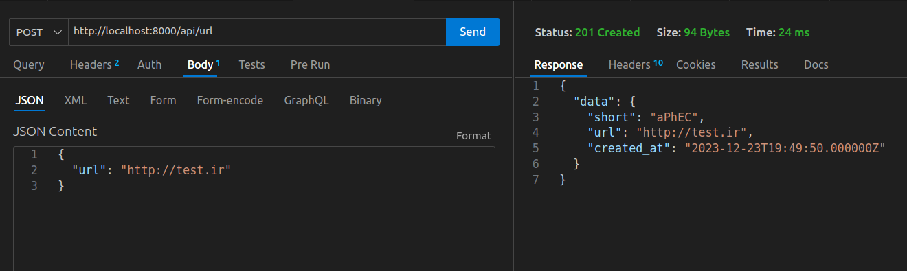
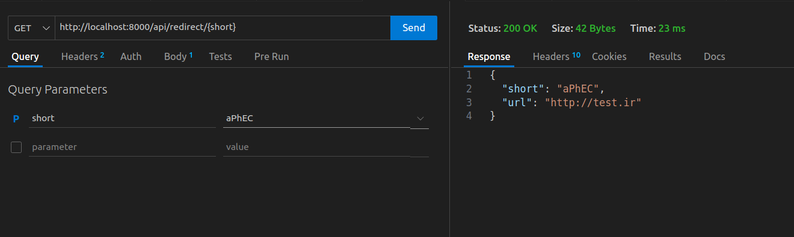

# Generate Short Url App
## `Intro`
ShortURL is a free tool to shorten URLs and generate short links

## `Setup`
### Clone the project

```bash
git clone git@github.com:mahdi375/ShortURL.git
```

### Copy env
```bash
cp ./.env.example .env
```

### Modify env file if desired
---
### Set up docker containers:
```bash
docker compose up -d --build
```
> `It takes about 10 seconds to bring all containers up and make them available due to health checking, following the building of Docker images.`

---

## `ToDos`:
- Complete APIs (show and delete)
- Record url statistics
- Add authentication
- 🚨 Clean up code (standadize api responses) 
- 🚨 Add Tests

---

## `Screenshots`:

